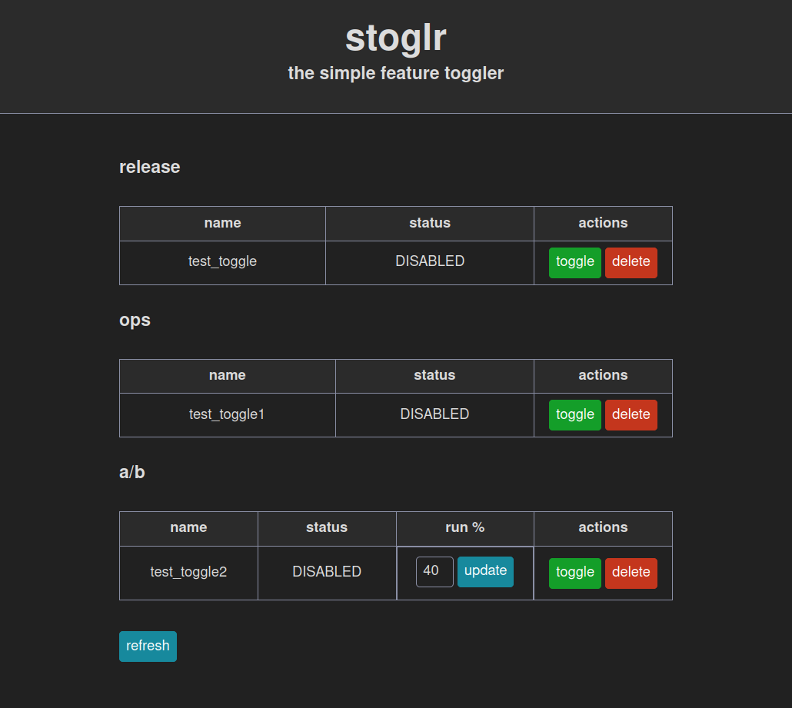

# stoglr
#### The Simple Feature Toggler
A feature toggling system written in Go, designed to be fast, lightweight, and as simple as possible.

## Table of Contents

- [Introduction](#introduction)
    - [Design Principles](#design)
    - [Technologies](#tech)
    - [Supported Toggle Types](#types)
- [Usage](#usage)
    - [Starting the Server](#start)
    - [Creating a Toggle](#create)
    - [Enabling and disabling a toggle](#lib-endis)
    - [Client Libraries (Coming Soon...)](#client)
    - [Managing Toggles with UI](#ui)
    - [Using the API to manage toggles](#api)

## <a name="introduction"></a> Introduction

This system is designed to do one thing: toggle code on and off based upon a value defined by the client. This enables
developers to release with confidence and protects the integrity of our environments. A toggle is code written into a
program that determines whether the code wrapped by it should be run (and in some case what should be run instead if
that condition is false). The system currently focuses on release, operations, and A/B toggles. This is a no-frills
system.

This system consists of two primary parts:
- Server application: maintains the state of toggles, acts as a basic CRUD application with a basic UI
- Client libraries: exposes the only necessary function for using the system with another code base (Not Yet Implemented)

By default (and as the only option currently), the system utilizes a runtime, in-memory datastore. This is perfectly acceptable for most situations, with the caviote that you
will need to re-enable toogles after the appliation restarts.

### <a name="design"></a> Design Principles

This system was built with the following design requirements in mind:

- should be easy for developers to use
- should be very fast as to not slow down regular operations
- should not require the developer to commit code to enable or disable the toggle
- should require minimal configuration on part of the developer
- toggles should be in the disabled state by default
- should not require a database to supply toggle information
- should not expose the ability for developer to enable or disable toggles within the code (with library)
- should minimize the dependencies required for the application

### <a name="tech"></a> Technologies Used

- Go 1.24 (Programming Language)
- Templ v0.3.857 (Template engine)
- HTMX 2.0.4 (JavaScript Library for reactive and restful HTML)
- Simple.css (CSS Framework)
- Make (Build Automation Tool)

#### Why Go and not X or Y Language?

Go was chosen as the primary language due to its simplicity, performance, and efficiency. It is known for being a statically typed compiled language that provides strong concurrency support without sacrificing speed. The Go standard library offers pretty much everything you could possibly need to build the core of this system, which minimizes dependency management.

#### Why Templ, HTMX, and Simple.css?

Templ was chosen as our template engine because it's ease of intergration with Go and its syntax that is intuitively similar to HTML. In the same light, HTMX is a lightweight, hypermedia-driven framework for creating reactive web pages without the need to leave HTML. By combining these two technologies, we get a simple and focused toolset for building interactive web UIs. Simple.css complements this approach, as it a very minimalistic CSS framework, which helps in keeping the UI clean and without styling distractions.

### <a name="types"></a> Supported Toggle Types

As mentioned above, there are 3 supported toggle types:

- RELEASE: Toggles that are meant to prevent the unintended release of a feature and should be removed upon release.
- OPS: Toggles that can be used to enable or disable a feature in any environment. A use case for this toggle might be
  the transition from one external system to another, in which we may desire to go back to the previous solution.
- AB: Toggles that are used to provide two experiences to the end user on a percentage basis. This is valuable when for
  UX testing. (Additional enhancements to this type of toggle to come in the future)

## <a name="usage"></a> Usage

### <a name="start"></a> Starting up the server

To start the server, build the project and then run it:

1. `make`
2. `./stoglr`

Optionally, you can specify the port to run on with `-p` flag:

`./stoglr -p 8081`
This starts up the server on port `8081` instead of the default `8080`.

```bash
Usage: stoglr [options]
  -help
        Show this help (exclusive with other options)
  -p string
        The port to listen on (default "8080")
  -v    Show version (exclusive with other options)
```


### <a name="create"></a> Creating a Toggle

Currently, creating a new toggle is done through an HTTP POST request to `/api/toggle/{name}` where `{name}` is the name of your toggle. You can specify additional parameters in the query string:
- type: The type of toggle you want to create (RELEASE, OPS or AB). Defaults to RELEASE if not specified.
- executes: This parameter only applies for AB toggles and specifies how many times the experiment should run. It's an integer value.

In the future, the preferred method of creating toggles will be through the appropriate client library for your programming language of choice.

### <a name="lib-endis"></a> Enabling and disabling a toggle

To enable or disable a toggle, you can either use the UI, or interact with the server's api via a REST client (example calls can be found <a href="client.http">here</a>).

### <a name="client"></a> Client Libraries/SDKs (WIP)

Currently, stoglr has client libraries for the following languages:

- Go (Found in the stoglr module under lib)

We also plan to support the following languages (more may be added in the future):

- Java
- Kotlin
- Rust
- Python
- Javascript

The client libraries are a critical part of this system and they will provide the appropriate usage. **stoglr is not consider production ready for your language until a library is available. That is not the only factor that determines production-readiness, but it is a major one. Using it without a library is not recommended.**

Generally, the library will at least one exposed method for usage:
 
 - `isEnabled(toggleName: string, type: string = 'release', executes: number = 100)`:
 This method should return a boolean indicating whether or not the toggle is enabled. Under the hood, this also creates the toggle specified in the code, elimating the need to manually create them and allowing them to be restored if stoglr is restarted. Enums will be used for the `type` parameter where appropriate. `executes` parameter will be ignored (or set back to 100) for non-AB type toggles.

 When possible, the library will also support:
```
withToggle(
    toggleName: string,
    type: string = 'release',
    executes: number = 100
    ) {
    ... behavior with toggle enabled... 
    }.elseDo {
    ... behavior with toggle disabled... 
    }
```

The client library will poll for updates every few seconds to check if any changes have been made to the state of any of the toggles. This polling can be disabled or adjusted to a lower frequency if desired, but is generally recommended and is enabled by default.

 Setup and configuration will depend on the language in question.

### <a name="ui"></a> Using the UI to manage toggles



The interface is very simple. It can be found at the root URL. Upon opening, you should see any toggles that are currently registered in the system
separated by type with their name, status, execution % with an update button (A/B only),
a toggle button, and a delete button.

The toggle button will switch the status between ENABLED and DISABLED. Release toggles can not be enabled in production
and, therefore, their toggle button will be grayed out in that environment (environment specific behavior is not yet implemented). 

The delete button deletes the associated toggle.

The update button for execution percentage modifies the percentage chance of the toggle being triggered when ENABLED.
For example, 100% will execute every time, 50% will execute half the time, and 0% will never execute. This feature is for A/B toggle functionality.

##### FAQs
(Functionality of the client library, not yet implemented)
- Don't see your toggle? This may be because the toggle has not been triggered yet within the code. Trigger it and then
  hit the refresh button.
- Oh no, you deleted a toggle that you needed! Don't worry. If the toggle is still in place within the code, it will be
  recreated in the disabled state once triggered.

### <a name="api"></a> Using the API to manage toggles 

To interact with the server, please see the see our the example calls [here](client.http).

